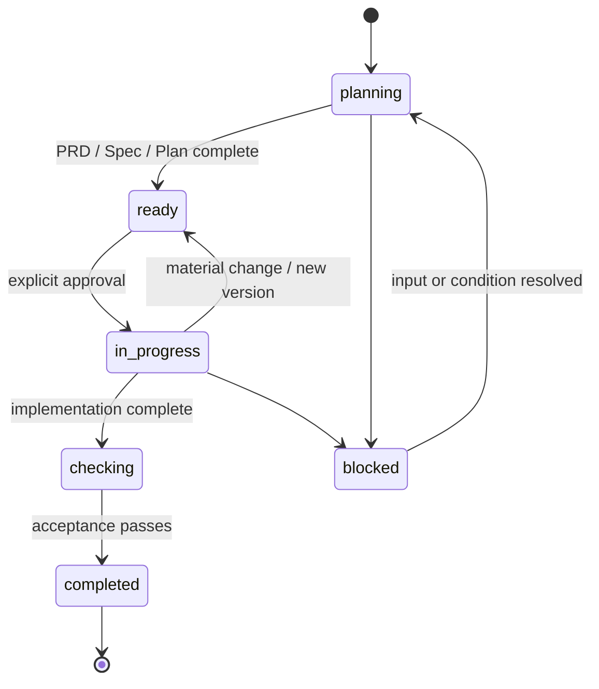

<div align="center">

# TaskFlow

### Durable task decisions for coding Agents.

**Local Markdown. Explicit approvals. Recoverable design history.**

[](skills/taskflow/SKILL.md)
[](skills/taskflow/references/artifacts.md)
[](LICENSE)

[Get started](#get-started) · [Why TaskFlow](#the-problem) · [Compare tools](#where-taskflow-fits) · [中文](README.zh-CN.md)


</div>

> [!IMPORTANT]
> **TaskFlow is a workflow convention, not an Agent.** It does not select tools or take decisions itself. It may coordinate with host/harness hooks (Claude Code and Codex CLI) for bounded bookkeeping and context summaries; hooks never write core documents and never approve. It gives humans and Agents a shared, inspectable place to record what a task means and how it changed.

<br />

## The problem

When an Agent ships code, the code is visible. The decisions that made it safe are often not.

<table>
<tr>
<td width="50%" valign="top">

### Without a durable task record

```text
chat → draft → edit → new chat → overwrite
               ↑
         "Which design was approved?"
```

- Requirements and design notes live in scattered chats.
- A new session cannot recover the real state of work.
- A requirement change overwrites the original proposal.
- Git records line edits, but not necessarily the decision boundary.
- Handoffs become another round of discovery.

</td>
<td width="50%" valign="top">

### With TaskFlow

```text
task directory → approval → implementation
      │               │
      └ old/vN/ ◀─────┘  material change
```

- One directory holds requirements, design, plan, and verification.
- States make progress and blockers explicit.
- Material decisions create a recoverable Task version.
- Markdown stays reviewable by people, Agents, and Git.
- Handoffs resume from facts instead of memory.

</td>
</tr>
</table>

## The core idea

```text
TaskFlowDocs/YYYY-MM-DD-short-slug/
├── prd.md          # what / why / scope / acceptance
├── spec.md         # how / contracts / trade-offs       (large tasks only)
├── plan.md         # approval / steps / verification / rollback
├── sessions.md     # handoff and resume context         (optional)
├── reference/      # evidence and research              (optional)
└── old/vN/         # superseded logical versions         (optional)
```

TaskFlow deliberately uses plain files. A human can read them, an Agent can load them, Git can diff them, and your project does not need another service to keep its task history.

## Repository documents

`TaskFlowDocs/repository-docs/index.md` is the authoritative routing and check record for repository rules, repository guidance, and scoped personal supplements. Repository-owned documents stay authoritative at their conventional source locations.

At SessionStart, TaskFlow deterministically refreshes index metadata for recognized documents and injects phase-applicable paths/status. The Agent reads the index first, follows its routes to authoritative sources, and records incorporated conclusions in the task Plan. The hook never copies policy text, edits source rules or core task documents, approves work, or mutates Git/hosting state.

Repository documents are authoritative. For non-trivial development, if `CONTRIBUTING.md` or `CODE_STYLE.md` is missing, TaskFlow derives the smallest evidence-based draft from the repository and asks up to three dependency-ordered questions for undecidable policy, then requires explicit user approval before the document becomes binding. `ROADMAP.md` is drafted only after the user confirms product direction; other governance documents are created only when the task needs them. Personal supplements under `repository-docs/personal/` are limited to stricter or orthogonal personal habits and cannot replace, weaken, or conflict with repository guidance. A material applicable-document change follows the same version gate as any other task-contract change.

For fork, remote, or pull-request work, TaskFlow records the configured remotes, intended target repository, base branch, local branch relationship, freshness limits, applicable host rules, and pre-PR checks. Remote names are not proof of role, and TaskFlow never silently adds or rewrites remotes, fetches, rebases, merges, pushes, opens PRs, or claims synchronization.

Run `bash hooks/repository-check [repo-root]` for an opt-in, read-only readiness summary. It reports missing baseline governance and ambiguous branch/remote information as `needs-user-input`; it is not attached to automatic hooks.

Any user correction or addition to an approved task is classified before documents change: wording or approach clarifications are work revisions that update only affected records and the Plan change log; changes to an approved goal, requirement, acceptance criterion, scope, or contract create a Task version and return to approval. TaskFlow never continues implementation using an outdated plan.

## Todo intake

TaskFlow applies automatically only to repository development requests: features, fixes, refactors, tests, configuration/build/CI changes, and release preparation. Read-only explanation, translation, status, research, review, and diagnosis do not create Todo or task documents; a later implementation request starts the workflow then. Explicitly invoking `$taskflow` opts planning or research into the workflow. For applicable requests, `TaskFlowDocs/todo.md` is the mandatory first record. An item moves from `inbox` to `clarified`, then is promoted into a task directory with `prd.md`, optional `spec.md`, and `plan.md`; it enters `in_progress` after approval and closes as `done` or `cancelled`.

After verification, TaskFlow moves the whole task directory to `TaskFlowDocs/achieved/<task-id>/`, updates the Todo item's task path and status to `done`, and verifies the active path is absent. If later work belongs to that achieved deliverable, it retrieves the directory to the active root, records the Todo source and reopen reason, creates a new Task version, and returns to approval before changing implementation. Achieved tasks are read-only; their `old/vN/` history is read only when the current documents or a version summary require it.

<details>
<summary><strong>Why not just rely on Git?</strong></summary>
<br />

Git is excellent at mechanical history. TaskFlow adds **semantic history**: a task version changes only when an approved goal, requirement, acceptance criterion, scope, architecture/interface/data contract, compatibility decision, risk decision, or standard changes; wording or implementation-approach clarifications are work revisions that stay on the current version. The archived version answers what the previous proposal meant, not merely which lines changed.

</details>

## The non-invasive promise

| TaskFlow adds | TaskFlow deliberately avoids |
| --- | --- |
| A shared `clarify → approve → implement → verify → archive` protocol | Being an Agent or a task manager; proxies, daemons, or API gateways |
| Project-local Markdown as task facts | Hidden state in a hosted database or proprietary UI |
| Explicit state, approval, handoff, rollback, and recovery records | Replacing your editor, Git host, test runner, or other Skills |
| A semantic version boundary for material decisions | Forcing an Agent model, programming language, framework, or toolchain |

Before substantive work in any phase, the Agent inspects the Skills, tools, MCP servers, and Agents currently available in the host and freely decides whether any materially help. TaskFlow requires no particular capability, provider, chain, category, or count. A capability selected for use is actually invoked or loaded through the host before its workflow or output is used; discovery or selection alone is not invocation. Outputs are reviewed before incorporation, and `plan.md` records only actual invocation attempts and their outcomes.

TaskFlow may also coordinate with host/harness hooks (Claude Code and Codex CLI) for mechanical bookkeeping and cheap resume context. A hook may update Todo triage metadata and inject a derived session-start summary; it never creates, rewrites, or deletes `prd.md`/`spec.md`/`plan.md`/`reference/index.md`, and never approves. Single-command archive/version/reopen helpers consolidate transitions. Hosts without hooks run the same flow unchanged.

## The one rule that prevents lost designs

<div align="center">

```text
ordinary edit                 material decision change
─────────────                 ────────────────────────
keep current vN               archive vN → create vN+1 → return to ready → approve
```

</div>

| This is a work revision | This creates a Task version |
| --- | --- |
| Wording, approach clarification within the approved design, typo, progress, test result | Goal, requirement, acceptance criterion, scope, architecture/interface/data contract, compatibility, risk, standard |
| Update current files + one Plan change-log line | Preserve the old version under `old/vN/`, then update current files |
| Git shows the edit | Git plus TaskFlow explain the decision |

### A concrete recovery story

```diff
  TaskFlowDocs/2026-09-05-billing-export/
  ├── prd.md                       # current v2: CSV export added
  ├── spec.md                      # current v2 design
  ├── plan.md                      # v2 approval + verification
+ └── old/v1/
+     ├── version.md               # why v1 was superseded
+     └── snapshot/                # v1 PRD / Spec / Plan recovery point
```

Someone changes the export requirement midway through implementation. Instead of rewriting the only design document, TaskFlow preserves `v1`, records why `v2` exists, and requires a new approval before implementation continues.

## Lifecycle at a glance



| State | Meaning |
| --- | --- |
| `planning` | Requirements, evidence, or design are being clarified. |
| `ready` | The current task documents are complete and waiting for approval. |
| `in_progress` | The approved plan is being implemented. |
| `checking` | Acceptance and quality checks are running. |
| `completed` | Verification passed; archive as read-only history. |
| `blocked` | A specific blocker is recorded with the required next input. |

## Get started

TaskFlow ships as a Claude Code / Codex plugin: the `hooks/`, skill, and install wiring are all in one marketplace. No copying files or editing `settings.json` by hand.

### Install with Claude Code

Add the TaskFlow marketplace, then install the plugin:

```bash
claude plugin marketplace add hkwuks/TaskFlow
claude plugin install taskflow@taskflow
```

> [!TIP]
> In-session, the same two steps are `/plugin marketplace add hkwuks/TaskFlow` then `/plugin install taskflow@taskflow`.

Verify it loaded:

```bash
claude plugin list
#   taskflow@taskflow    Version: 1.0.2    Status: ✔ enabled
```

### Install with Codex CLI

Add the same marketplace, then install the plugin:

```bash
codex plugin marketplace add hkwuks/TaskFlow
codex plugin add taskflow@taskflow
```

Verify it loaded:

```bash
codex plugin list
#   taskflow@taskflow    installed, enabled
```

### Prefer a local copy?

If you do not want to trust the remote repo, point the marketplace at your
checked-out copy instead of GitHub — the plugin and hooks then run from files
you control:

```bash
# Claude Code
claude plugin marketplace add <repo-root>
claude plugin install taskflow@taskflow

# Codex CLI
codex plugin marketplace add <repo-root>
codex plugin add taskflow@taskflow
```

Once installed, tell your Agent:

```text
Use $taskflow to plan, execute, verify, and archive this task.
```

Then: add ideas to `TaskFlowDocs/todo.md`; promote clarified items into `prd.md`, `spec.md` (when needed), and `plan.md`; review the task documents, record approval, then implement one planned step at a time using its checklist.

> [!TIP]
> A small, obvious one-file change can still be a direct change with minimal verification. TaskFlow does not create documents merely to satisfy a process.

> [!NOTE]
> Hooks are optional. The plugin installs a SessionStart hook that prints a short derived state summary (inbox items + active tasks) so the Agent does not re-read the whole tree; it writes nothing and never approves. Hosts without hooks run the exact same flow.

For mechanical lifecycle edits, the Agent can explicitly run `hooks/run-hook.cmd task intake|promote|state|progress|complete`; these write commands are not event-bound hooks.

## Where TaskFlow fits

TaskFlow is not trying to replace specification-driven development, role-based multi-agent methods, or project management. It covers a specific missing layer: **durable task facts, state boundaries, and recoverable decision history inside the repository.**

| | TaskFlow | [Spec Kit](https://github.com/github/spec-kit) | [OpenSpec](https://github.com/Fission-AI/OpenSpec) | [BMAD-METHOD](https://github.com/bmad-code-org/BMAD-METHOD) | Issue tracker / PM tool |
| --- | --- | --- | --- | --- | --- |
| **Primary concern** | Task state and semantic history | Spec-driven workflow | Configurable spec/change workflow | Role-based Agent methodology | Ownership and coordination |
| **Core unit** | Local TaskFlowDocs directory | Specs and workflow artifacts | Specs and changes | Agents, roles, workflows | Tickets, cards, issues |
| **Design recovery** | Explicit `old/vN/` archive | Adoption/repository dependent | Project/Git practice dependent | Workflow/repository dependent | Usually activity history only |
| **Agent interaction** | Skill instructions + bounded host-hook coordination (Claude Code, Codex) | Tool/workflow conventions | Configurable workflow conventions | Role and orchestration patterns | Usually outside Agent context |
| **Infrastructure** | Markdown + filesystem + Git | Adopted repository tooling | Adopted repository tooling | Method assets + adopted tooling | Usually a hosted service |
| **Use it with TaskFlow?** | — | Generate specs, then route reviewed task facts into TaskFlow | Route reviewed specs/changes into TaskFlow | Keep role outputs as reviewed task references | Link a ticket to its task directory |

### Choose the right layer

<table>
<tr><td><strong>Choose TaskFlow</strong></td><td>You lose task context, overwrite designs, or struggle to resume work across sessions and Agents.</td></tr>
<tr><td><strong>Choose Spec Kit / OpenSpec</strong></td><td>You primarily need a broad or configurable spec-driven development workflow.</td></tr>
<tr><td><strong>Choose BMAD-METHOD</strong></td><td>You need a role-based multi-Agent delivery methodology.</td></tr>
<tr><td><strong>Choose an issue tracker</strong></td><td>You need prioritization, ownership, deadlines, and reports.</td></tr>
<tr><td><strong>Combine them</strong></td><td>Use external tools to coordinate work; use TaskFlow to preserve the decisions that make it recoverable.</td></tr>
</table>

> [!NOTE]
> This is a positioning comparison, not a benchmark or a claim of feature parity. Check each project's current documentation before adoption.

## Guardrails, not bureaucracy

| Principle | In practice |
| --- | --- |
| **One task, one source of truth** | Keep the active task facts in one task directory. |
| **Lightest useful artifact** | Omit `spec.md` for a small, self-contained task. |
| **Archive before replace** | Capture the old logical version before a material update. |
| **Approval is explicit** | `ready` never silently becomes `in_progress`. |
| **Verification is a fact** | Record what was checked and the result in `plan.md`. |
| **Tools stay optional** | Other Skills can contribute; reviewed task artifacts remain authoritative. |

## Project map

```text
skills/taskflow/
├── SKILL.md                         # workflow entry point
├── agents/openai.yaml               # display metadata and default prompt
└── references/
    ├── artifacts.md                 # templates and output routing
    └── versioning-and-recovery.md   # semantic versions and safe restoration
```

## License

Distributed under [AGPL-3.0](LICENSE).
