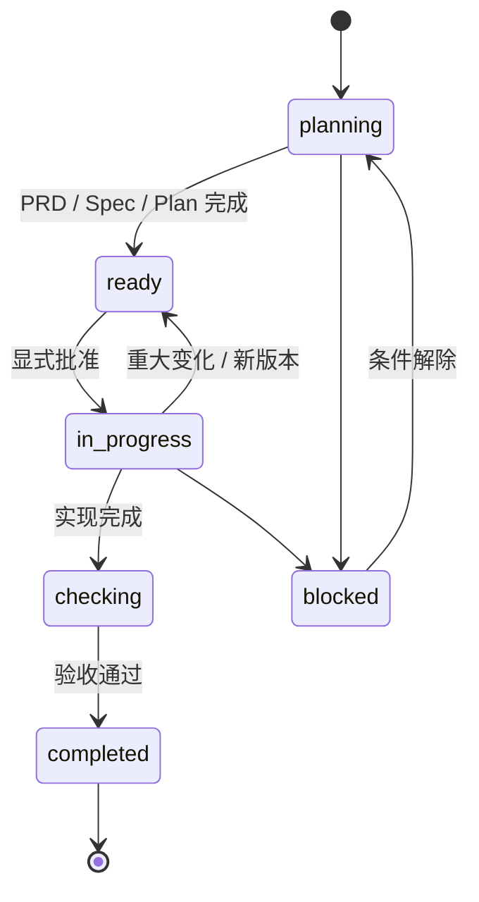

<div align="center">

# TaskFlow

### 为编码 Agent 保存可追溯的任务决策。

**本地 Markdown · 显式批准 · 可恢复设计历史**

[](skills/taskflow/SKILL.md)
[](skills/taskflow/references/artifacts.md)
[](LICENSE)

[English](README.md) · **中文说明** · [验证与 CI](#验证与-ci)


</div>

> [!IMPORTANT]
> **TaskFlow 是流程约定，不是 Agent。** 它不选择工具、也不替 Agent 决策。它可与宿主/工具链 hook（Claude Code、Codex CLI、CodeBuddy 与 dsh）协作做有边界的记账和上下文摘要；hook 绝不写核心文档、绝不代为批准。它为人和 Agent 提供一个共同的、可检查的地方，记录任务是什么以及它如何变化。

## 它解决什么问题

Agent 可以很快交付代码，但代码背后的决策经常留不住：

| 没有持久任务记录 | 使用 TaskFlow |
| --- | --- |
| 需求、设计、计划散落在聊天和临时文件里 | 一个任务目录集中保存 PRD、Spec、Plan 和验证 |
| 新会话不知道哪些结论已确认 | 状态与批准记录明确可见 |
| 需求修改覆盖原设计，无法找回 | 重大变化先归档 `old/vN/`，再创建新版本 |
| 多人/多 Agent 按不同理解继续工作 | 共享同一份任务事实和版本边界 |
| 代码完成了，但取舍和验证过程消失 | 任务目录可随 Git 审查、交接和恢复 |

## 核心模型

```text
TaskFlowDocs/YYYY-MM-DD-short-slug/
├── prd.md          # 做什么 / 为什么 / 范围 / 验收
├── spec.md         # 怎么做 / 契约 / 取舍       （大型任务才需要）
├── plan.md         # 批准 / 步骤 / 验证 / 回滚
├── sessions.md     # 交接与恢复上下文           （可选）
├── reference/      # 调研与证据                 （可选）
└── old/vN/         # 被替代的逻辑版本             （可选）
```

这些文件刻意保持朴素：人能阅读，Agent 能加载，Git 能 diff，项目无需额外服务即可保存历史。

## 仓库文档

`TaskFlowDocs/repository-docs/index.md` 是仓库规则、仓库指引和有范围个人规则的权威路由与检查记录；具体规则内容仍以惯用位置上的源文档为准。

规划或实施非简单任务前，TaskFlow 仅在目录缺失、过期或任务需要未编目的文档类型时刷新目录，然后读取任务阶段适用的文档。目录只记录仓库相对路径，不把仓库自有文档复制或软链接到 `repository-docs/`；该目录只包含 `index.md` 和可选的 `personal.md` 个人规则（每条规则是文件内独立 section）。经明确授权创建缺失文档时，TaskFlow 优先沿用已有惯用文件名，否则对应使用 `README.md`、`CONTRIBUTING.md`、`CODE_STYLE.md` 或 `ROADMAP.md`。发现遗留副本或链接时只报告，未经明确授权不迁移、不删除。

仓库文档优先于个人规则。对于非简单开发，如果缺少 `CONTRIBUTING.md` 或 `CODE_STYLE.md`，TaskFlow 会根据仓库证据起草最小可执行版本；无法从证据判断的政策每次最多按依赖顺序询问三个问题并给出建议，且必须经用户明确批准后才成为约束。`ROADMAP.md` 只有在用户确认产品方向后才起草；其他治理文档仅在当前任务需要时创建。`repository-docs/` 下的个人规则只能增加更严格或正交的个人习惯，不能替代、弱化或冲突于仓库文档；个人规则只存在于本地，不进入 Git，需要共享时改为仓库自有文档。适用文档契约的实质变化遵循与其他任务契约相同的版本门禁。

涉及 fork、远端或 Pull Request 时，TaskFlow 会记录已配置的 remote、目标仓库、base 分支、本地分支关系、远端跟踪信息的新鲜度限制、适用的托管平台规则和提交 PR 前检查。remote 名称不能证明其角色；TaskFlow 不会静默添加或改写 remote、fetch、rebase、merge、push、创建 PR 或声称已同步。

TaskFlow 从不在 base 工作区里写任务文档：每个任务使用独立短生命周期分支与独立工作区，且在工作区的建立是在**第一份任务文档之前**，而不是第一次改动之前。分支规则写在 `CONTRIBUTING.md`，worktree 规则写在 Skill 中。

由于所有任务都追加同一个 `TaskFlowDocs/todo.md`，TaskFlow 为它内置了 Git 合并驱动，由 `hooks/session-start` 按克隆安装。两个分支各自新增条目、或修改不同条目时无需人工介入；同一条目两侧改法不同仍会保留为真实冲突。Todo ID 由目标内容派生而非递增计数，因此同一基点切出的两个分支不会分到同一个 ID。在托管平台网页端合并 PR 时由服务端执行，不会使用该驱动，这条路径仍退化为普通内容冲突。

创建或更新 Pull Request 前，TaskFlow 必须读取适用的 `.github/pull_request_template.md`，完成每个必填项，在 `plan.md` 中记录字段映射和验证结果；必填项缺失或有歧义时禁止修改 PR。

可以运行 `bash hooks/repository-check [repo-root]` 获取可选的只读检查摘要。它会把缺失的基础治理文档和不明确的分支/远端信息标记为 `needs-user-input`，并列出该 checkout 里未提交的任务产物——未提交的任务目录会跟着你进入下一个 `git checkout` 的分支，于是被下一个任务接手。任务产物这一段不影响退出码，也不会挂到自动 hook 上。`bash hooks/release-check [repo-root]` 是同一类面向发布的报告：比对四个插件 manifest、`CHANGELOG.md` 最新的版本段落、两份 README 的 `claude plugin list` 示例中的版本号，并确认 marketplace 的 `ref` 与它声明的 `sha` 指向同一个提交。版本不一致时退出 `2`，manifest 缺失时退出 `3`；CI 在每次改动上都会运行它。

用户对已批准任务提出修正或新增要求时，TaskFlow 必须先分类再修改文档：只改措辞或实现路径的澄清属于工作修订，仅更新受影响记录并在 Plan 变更日志记一行；改动已批准的目标、需求、验收、范围或契约才创建新 Task version 并回到批准门禁。不得带着过期 Plan 继续实施。

## Todo 收件箱

TaskFlow 只自动用于仓库开发需求：功能、Bug 修复、重构、测试、配置/构建/CI 变更。**发布是例外**——它直接在 base 检出上执行 `RELEASE.md`，不创建 Todo 条目、任务目录、分支，也不写 PRD/Plan；它的记录是 `CHANGELOG.md` 段落与 GitHub Release 正文。只读解释、翻译、状态查询、研究、审查和诊断不会创建 Todo 或任务文档；若之后要求实施，再从该实施请求开始进入流程。用户显式调用 `$taskflow` 时，规划或研究也会进入流程。对于适用请求，`TaskFlowDocs/todo.md` 是强制首条记录；条目按 `inbox → clarified → promoted → in_progress → done/cancelled` 演进，提升后创建 `prd.md`、按需创建 `spec.md` 和 `plan.md`，批准后才进入实施。

验证通过后，TaskFlow 将整个任务目录移入 `TaskFlowDocs/achieved/<task-id>/`，同步 Todo 的任务路径和 `done` 状态，并确认活动路径已不存在。已归档任务只读；其 `old/vN/` 历史仅在当前文档或版本摘要需要时才读取。之后若新工作属于该已完成交付物，先将目录取回活动根目录，记录 Todo 来源与重新打开原因，创建新的 Task version，并在修改实现前重新经过批准门禁。

<details>
<summary><strong>为什么不能只依赖 Git？</strong></summary>
<br />

Git 擅长记录机械修改；TaskFlow 增加的是**语义历史**：只有目标、范围、验收、架构、接口/数据契约、兼容性或风险决策发生变化，才创建新的 Task version（措辞与实现路径澄清为工作修订，不走版本通道）。这样保存的是“上一版设计意味着什么”，而不只是“哪些行变了”。

</details>

## 无侵入 Agent

| TaskFlow 提供 | TaskFlow 不会做 |
| --- | --- |
| 澄清 → 批准 → 实施 → 验证 → 归档的共同协议 | 当 Agent 或任务管理器本身；代理、守护进程或 API 网关 |
| 项目内 Markdown 任务事实 | 把状态藏在托管数据库或专有 UI |
| 状态、批准、交接、回滚和恢复记录 | 替换编辑器、Git、测试工具或其他 Skills |
| 重大决策的语义版本边界 | 强制 Agent 模型、编程语言、框架或工具链 |

在任一阶段开始实质工作前，Agent 都会检查宿主当前可用的 Skill、工具、MCP Server 和 Agent，并自由判断是否有能力能提供实质帮助。TaskFlow 的产物名称是它自己的，因此阶段与能力按「产物对应的概念类别」匹配，而不是按 TaskFlow 的名称匹配。TaskFlow 不强制选择任何特定能力，也不限定名称、提供方、调用链、能力类别或数量。Agent 一旦选择使用某项能力，就先通过宿主机制真实调用或加载，再采用其工作流或输出；发现或选择本身不算调用。所有输出都先审阅再纳入，`plan.md` 只记录真实调用尝试及其结果。

TaskFlow 还可与宿主/工具链 hook（Claude Code、Codex CLI、CodeBuddy 与 dsh）协作：会话启动时，hook 只确定性维护 `repository-docs/index.md` 的路由元数据，并注入当前阶段适用的源文档路径和状态。Agent 先读 index，再读取其中导流的权威源文档，并把采用的路径和结论记录进 Plan。hook 不复制规则正文，不修改源规则、核心任务文档或审批，也不改变 Git 或托管平台状态。

## 防止设计丢失的一条规则

```text
普通修改：保持当前 vN

重大决策变化：归档 vN → 创建 vN+1 → 回到 ready → 重新批准
```

| 属于工作修订 | 会创建 Task version |
| --- | --- |
| 措辞、批准设计内的实现路径澄清、错别字、进度、测试结果 | 目标、需求、验收、范围、架构/接口/数据契约、兼容性、风险、标准 |
| 更新当前文件 + Plan 变更日志记一行 | 先把旧版本存进 `old/vN/`，再更新当前文件 |
| Git 显示这次编辑 | Git 与 TaskFlow 共同解释这次决策 |

### 一个具体的恢复示例

```diff
  TaskFlowDocs/2026-09-05-billing-export/
  ├── prd.md                       # 当前 v2：新增 CSV 导出
  ├── spec.md                      # 当前 v2 设计
  ├── plan.md                      # v2 批准与验证
+ └── old/v1/
+     ├── version.md               # v1 为什么被替代
+     └── snapshot/                # v1 恢复点
```

需求中途变化时，TaskFlow 不会覆盖唯一的设计文件，而是保留 v1、记录 v2 的变化原因，并要求重新批准后继续实施。

## 生命周期



| 状态 | 含义 |
| --- | --- |
| `planning` | 澄清需求、证据和设计 |
| `ready` | 文档完成，等待批准 |
| `in_progress` | 按批准后的计划实施 |
| `checking` | 运行验收与质量检查 |
| `completed` | 验证通过，作为只读历史归档 |
| `blocked` | 记录具体阻塞和所需输入 |

> [!WARNING]
> `ready` 不等于批准。批准必须写入 `plan.md`，然后才能进入 `in_progress`。

## 快速开始

TaskFlow 以插件形式分发（Claude Code / Codex / CodeBuddy 同一套市场，dsh 为独立插件包）：`hooks/`、技能与安装配置都在一个仓库里，无需手动复制文件或手改 `settings.json`。

### 用 Claude Code 安装

先添加 TaskFlow 市场，再安装插件：

```bash
claude plugin marketplace add hkwuks/TaskFlow
claude plugin install taskflow@taskflow
```

市场目录跟踪 `main`，但其中的稳定版插件条目固定到已发布的 tag 和 commit SHA。因此刷新市场只会发现经过发布验证的版本，不会直接安装 `main` 上尚未发布的改动。

> [!TIP]
> 会话内同样两步：`/plugin marketplace add hkwuks/TaskFlow` 然后 `/plugin install taskflow@taskflow`。

验证是否加载成功：

```bash
claude plugin list
#   taskflow@taskflow    Version: 1.1.0    Status: ✔ enabled
```

更新已有安装：

```bash
claude plugin marketplace update taskflow
claude plugin update taskflow@taskflow
claude plugin list
```

### 用 Codex CLI 安装

添加同一个市场，再安装插件：

```bash
codex plugin marketplace add hkwuks/TaskFlow
codex plugin add taskflow@taskflow
```

Codex 与 Claude Code 使用同一个固定版本条目；manifest 版本、Git tag 和固定 commit 共同标识已安装的稳定构建。

验证是否加载成功：

```bash
codex plugin list
#   taskflow@taskflow    installed, enabled
```

更新已有安装：

```bash
codex plugin marketplace upgrade
codex plugin add taskflow@taskflow
codex plugin list
```

### 用 CodeBuddy 安装

添加同一套市场，然后安装插件。这些是 **CodeBuddy Code CLI** 命令——CodeBuddy IDE 客户端并不实现它们：

```bash
codebuddy plugin marketplace add hkwuks/TaskFlow
codebuddy plugin install taskflow@taskflow
```

CodeBuddy 读取 `.codebuddy-plugin/marketplace.json` 这份目录，其中带有与其它宿主一致的固定版本条目。manifest 通过 CodeBuddy 自家插件使用的 `CODEBUDDY_PLUGIN_ROOT` 变量接入 SessionStart hook。

确认已加载：

```bash
codebuddy plugin list
#   > taskflow@taskflow
#     Version: 1.1.0
#     Scope: user
#     Status: enabled
```

更新已有安装：

```bash
codebuddy plugin marketplace update taskflow
codebuddy plugin install taskflow@taskflow
codebuddy plugin list
```

CodeBuddy 通过 `/reload-plugins` 重新加载 hooks、技能和代理，无需重启。

### 用 dsh 安装

TaskFlow 的仓库根目录本身就是一个 dsh 插件包，安装它的 profile 会把它作为一层
bundle 加载：

```bash
dsh plugin --profile web add dsh-taskflow
```

从本地检出目录安装则直接指向该目录：

```bash
dsh plugin --profile web add <仓库根目录>
```

该包声明了 `dsh.bundle.patch`，所以 `dsh` 会自行把它追加到 profile 的
`dsh.profile.bundles`——不需要手写任何 profile YAML。启动该 profile 即可挂载
TaskFlow 的技能与 SessionStart hook。

dsh 通过 `hooks/hooks-dsh.json` 和 dsh 自带的 Claude Code hook 桥接，运行与其它宿主
同一个 `hooks/session-start` 脚本。桥接的两个特性决定了这份配置的形态，两者都能在该
文件中看到：hook 走 dsh 的拦截点而不是插件 manifest，命令串带有 `CLAUDE_PLUGIN_ROOT`
前缀则是因为桥接只在该字符串内替换这个变量、并不导出它，而 `session-start` 依据环境
变量选择输出格式。

dsh 的 SessionStart 来源是 `startup`、`resume`、`clear`、`compact`，没有 `fork`，
因此 dsh 的 matcher 不含它。

dsh 没有插件市场，且 `dsh plugin add` 经由 pnpm 解析，所以升级用
`dsh plugin --profile web update`。

### 想用本地副本？

开发或检查源码时，可以把市场指向本地检出目录而不是 GitHub。这样会有意绕过远程稳定版固定点，插件和 hooks 改为使用你控制的本地文件：

```bash
# Claude Code
claude plugin marketplace add <仓库根目录>
claude plugin install taskflow@taskflow

# Codex CLI
codex plugin marketplace add <仓库根目录>
codex plugin add taskflow@taskflow

# CodeBuddy
codebuddy plugin marketplace add <仓库根目录>
codebuddy plugin install taskflow@taskflow

# dsh（无市场：目录本身即插件包）
dsh plugin --profile web add <仓库根目录>
```

安装后告诉你的 Agent：

```text
使用 $taskflow 规划、执行、验证并归档这个任务。
```

然后把想法记录到 `TaskFlowDocs/todo.md`；澄清后的条目再提升为 `prd.md`、按需的 `spec.md` 和 `plan.md`；审阅任务文档并记录批准，再按每个步骤的 checklist 实施和记录验证结果。

> [!TIP]
> 边界清晰的简单单文件修改可以直接完成并做最小验证，不必为了流程创建空文档。

> [!NOTE]
> Hooks 是可选的。插件安装的 SessionStart hook 注入一份简短的状态摘要（未完成的收件箱条目 + 活跃任务）和当前阶段适用的仓库文档路由，让 Agent 不必重读整棵树。它从不创建、改写或删除 `prd.md`/`spec.md`/`plan.md`/`reference/index.md`，也从不批准；它唯一会写的文件是所选任务的 `sessions.md` 会话索引和 `TaskFlowDocs/repository-docs/index.md` 里确定性的路由元数据。没有 hooks 的宿主按同样的流程运行。

对于机械性的生命周期更新，Agent 可以显式运行 `hooks/run-hook.cmd task intake|promote|state|progress|complete`；这些写命令不会绑定到事件 Hook。

## 验证与 CI

每条检查都是仓库根目录下的普通脚本——不需要服务、不需要测试框架，除工具自身外不需要语言运行时：

| 命令 | 检查什么 |
| --- | --- |
| `bash hooks/smoke-test` | 构造临时 `TaskFlowDocs` 夹具，通过 hook 跑完整生命周期。`hooks/smoke-test-windows.ps1` 是 Windows 上的等价实现（PowerShell 5.1 + `run-hook.cmd`）。 |
| `bash hooks/repository-check .` | 只读的仓库就绪度检查：缺失的基础治理文档、不明确的分支/远端信息，标记为 `needs-user-input`。 |
| `bash hooks/release-check .` | 一次发布要改动的所有版本字面量是否一致，以及每个 marketplace pin 是否解析到它 `sha` 声明的那个提交。不一致退出 `2`，manifest 缺失退出 `3`。 |
| `python3 evals/runner.py` | 针对不可变示例任务树的离线路由评测。runner 属于仓库工具链，是这里唯一需要 Python 的东西。 |

`.github/workflows/hooks.yml` 在每次推送 `main` 和每个 Pull Request 上跑四个作业：`smoke`（Ubuntu / macOS / Windows 矩阵）、`release`、`todo-merge-audit`（推送范围内没有 merge 丢掉 Todo 条目）、`evals`。smoke 作业刻意不安装任何语言运行时——hook 本身不依赖运行时，所以一旦某个 hook 长出解释器依赖，会在这里失败，而不是等到用户会话里才暴露。

`CONTRIBUTING.md` 列出提交 Pull Request 前必须跑的检查，包括 `hooks/smoke-test`、Skill 校验器和 `git diff --check`。`RELEASE.md` 是发布清单：一次发布要挪动的版本字面量、发布标签与其 catalog pin 必须遵守的两提交顺序，以及回退规则。它在 base 检出上执行，而不是作为一个 TaskFlow 任务。

hook 本身的说明在 [`hooks/README.md`](hooks/README.md)——每个 hook 允许写什么、为什么是 extensionless bash 且不依赖语言运行时，以及各宿主的接线方式。

## 与相邻工具的比较

TaskFlow 不试图替代 SDD、角色化多 Agent 方法或项目管理工具，它覆盖的是一个更具体的层：**仓库内持久化的任务事实、状态边界和可恢复决策历史。**

| | TaskFlow | [Spec Kit](https://github.com/github/spec-kit) | [OpenSpec](https://github.com/Fission-AI/OpenSpec) | [BMAD-METHOD](https://github.com/bmad-code-org/BMAD-METHOD) | Issue / 项目管理工具 |
| --- | --- | --- | --- | --- | --- |
| **主要关注** | 任务状态与语义历史 | 规范驱动开发流程 | 可配置的规范/变更流程 | 角色化 Agent 方法论 | 负责人和任务协调 |
| **核心单元** | 本地 TaskFlowDocs 目录 | Spec 与工作流产物 | Spec 与 change 产物 | Agent、角色与工作流 | Ticket、Card、Issue |
| **设计恢复** | 明确的 `old/vN/` 归档 | 取决于仓库和采用的流程 | 取决于项目配置与 Git 实践 | 取决于所选流程和仓库历史 | 通常只有活动记录 |
| **Agent 交互** | Skill 指令 + 有边界的宿主 hook 协作（Claude Code、Codex、CodeBuddy、dsh） | 工具/工作流约定 | 可配置工作流约定 | 角色与编排模式 | 通常在 Agent 上下文之外 |
| **基础设施** | Markdown + 文件系统 + Git | 仓库文件与配套工具 | 仓库文件与配套工具 | 方法论资产与配套工具 | 通常是托管服务 |
| **如何组合** | — | 用于生成规范，再将审阅后的事实放入任务目录 | 将审阅后的 Spec/change 放入任务目录 | 将角色产出作为参考/任务产物保存 | 将 Ticket 链接到任务目录 |

### 如何选择

<table>
<tr><td><strong>选择 TaskFlow</strong></td><td>你经常丢失任务上下文、覆盖已有设计，或者跨会话、跨 Agent 难以恢复工作。</td></tr>
<tr><td><strong>选择 Spec Kit / OpenSpec</strong></td><td>你主要需要一套完整或可配置的规范驱动开发流程。</td></tr>
<tr><td><strong>选择 BMAD-METHOD</strong></td><td>你需要角色化的多 Agent 交付方法论。</td></tr>
<tr><td><strong>选择 Issue Tracker</strong></td><td>你需要优先级、负责人、期限和报表。</td></tr>
<tr><td><strong>组合使用</strong></td><td>用外部工具协调工作，用 TaskFlow 保存那些让工作可恢复的决策。</td></tr>
</table>

> [!NOTE]
> 这是定位比较，不是基准测试或功能数量排名。采纳前请核对各项目当前文档与兼容性。

## 护栏，而非官僚流程

| 原则 | 落地方式 |
| --- | --- |
| **一个任务，一个事实来源** | 活跃任务的事实只放在一个任务目录里。 |
| **最轻量的可用产物** | 小而自包含的任务省略 `spec.md`。 |
| **先归档，再替换** | 重大更新前先保存旧的逻辑版本。 |
| **批准必须显式** | `ready` 绝不会悄悄变成 `in_progress`。 |
| **验证是一个事实** | 在 `plan.md` 里记录检查了什么、结果如何。 |
| **工具保持可选** | 其他 Skill 可以贡献内容；经审阅的任务产物仍是权威。 |

## 仓库结构

```text
skills/taskflow/                     # 工作流本体
├── SKILL.md                         # 工作流入口
├── agents/openai.yaml               # Agent 元数据与默认提示词
└── references/
    ├── artifacts.md                 # 文档模板与输出路由
    ├── runtime.md                   # hook 规则与宿主事件映射
    └── versioning-and-recovery.md   # 版本切换与安全恢复规则

hooks/                               # 可选的宿主/工具链 hook —— 见 hooks/README.md
├── session-start                    # SessionStart 入口
├── session-record                   # 把宿主会话 id 写进 sessions.md
├── summarize-state                  # 派生状态摘要（共享逻辑）
├── repository-docs-context          # 同步 index 元数据并派生路由
├── install-merge-driver             # 安装仓库本地的 Todo 合并驱动
├── merge-todo                       # 驱动本体：按条目合并 todo.md
├── task / archive / version / reopen # 显式生命周期命令
├── release-check / todo-check       # 发布版本字面量；被丢掉的 Todo 条目
├── hooks{,-codex,-codebuddy}.json   # 每个宿主一份接线文件
└── run-hook.cmd                     # 跨平台启动器

evals/                               # 离线路由评测（runner.py + cases/、fixtures/）
tools/fixture-compare                # 逐字节比对两次 smoke-test 的夹具
.claude-plugin/ .codex-plugin/ .codebuddy-plugin/   # 各宿主清单与目录
.github/workflows/hooks.yml          # CI：smoke 矩阵、release、todo 审计、evals
```

## 许可证

[AGPL-3.0](LICENSE)
