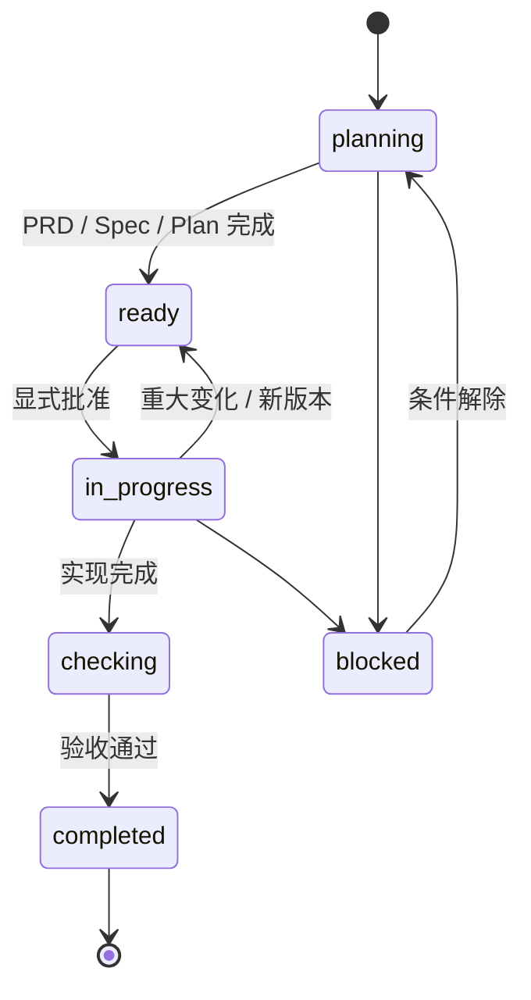

<div align="center">

# TaskFlow

### 为编码 Agent 保存可追溯的任务决策。

**本地 Markdown · 显式批准 · 可恢复设计历史**

[](taskflow/SKILL.md)
[](taskflow/references/artifacts.md)
[](LICENSE)

[English](README.md) · **中文说明**


</div>

> [!IMPORTANT]
> **TaskFlow 是流程约定，不是 Agent 运行时。** 它不会拦截 Prompt、工具调用或模型行为，只为人和 Agent 提供一个共同的、可检查的地方，记录任务是什么以及它如何变化。

## 它解决什么问题

Agent 可以很快交付代码，但代码背后的决策经常留不住：

| 没有持久任务记录 | 使用 TaskFlow |
| --- | --- |
| 需求、设计、计划散落在聊天和临时文件里 | 一个任务目录集中保存 PRD、Spec、Plan 和验证 |
| 新会话不知道哪些结论已确认 | 状态与批准记录明确可见 |
| 需求修改覆盖原设计，无法找回 | 重大变化先归档 `old/vN/`，再创建新版本 |
| 多人/多 Agent 按不同理解继续工作 | 共享同一份任务事实和版本边界 |
| 代码完成了，但取舍和验证过程消失 | 任务目录可随 Git 审查、交接和恢复 |

## 核心模型

```text
tasks/YYYY-MM-DD-short-slug/
├── prd.md          # 做什么 / 为什么 / 范围 / 验收
├── spec.md         # 怎么做 / 契约 / 取舍       （大型任务才需要）
├── plan.md         # 批准 / 步骤 / 验证 / 回滚
├── sessions.md     # 交接与恢复上下文           （可选）
├── reference/      # 调研与证据                 （可选）
└── old/vN/         # 被替代的逻辑版本             （可选）
```

这些文件刻意保持朴素：人能阅读，Agent 能加载，Git 能 diff，项目无需额外服务即可保存历史。

<details>
<summary><strong>为什么不能只依赖 Git？</strong></summary>
<br />

Git 擅长记录机械修改；TaskFlow 增加的是**语义历史**：只有目标、范围、验收、架构、契约、兼容性、风险或实现路径发生变化，才创建新的 Task version。这样保存的是“上一版设计意味着什么”，而不只是“哪些行变了”。

</details>

## 无侵入 Agent

| TaskFlow 提供 | TaskFlow 不会做 |
| --- | --- |
| 澄清 → 批准 → 实施 → 验证 → 归档的共同协议 | 运行时 Hook、代理、守护进程或 API 网关 |
| 项目内 Markdown 任务事实 | 把状态藏在托管数据库或专有 UI |
| 状态、批准、交接、回滚和恢复记录 | 替换编辑器、Git、测试工具或其他 Skills |
| 重大决策的语义版本边界 | 强制 Agent 模型、编程语言、框架或工具链 |

Agent 仍然自由选择实现方式；TaskFlow 只让周边约定变得持久、一致、可恢复。

## 防止设计丢失的一条规则

```text
普通修改：保持当前 vN

重大决策变化：归档 vN → 创建 vN+1 → 回到 ready → 重新批准
```

```diff
  tasks/2026-09-05-billing-export/
  ├── prd.md                       # 当前 v2
  ├── spec.md                      # 当前 v2 设计
  ├── plan.md                      # v2 批准与验证
+ └── old/v1/
+     ├── version.md               # v1 为什么被替代
+     └── snapshot/                # v1 恢复点
```

需求中途变化时，TaskFlow 不会覆盖唯一的设计文件，而是保留 v1、记录 v2 的变化原因，并要求重新批准后继续实施。

## 生命周期



| 状态 | 含义 |
| --- | --- |
| `planning` | 澄清需求、证据和设计 |
| `ready` | 文档完成，等待批准 |
| `in_progress` | 按批准后的计划实施 |
| `checking` | 运行验收与质量检查 |
| `completed` | 验证通过，作为只读历史归档 |
| `blocked` | 记录具体阻塞和所需输入 |

> [!WARNING]
> `ready` 不等于批准。批准必须写入 `plan.md`，然后才能进入 `in_progress`。

## 快速开始

```text
1. 将 taskflow/ 放入项目的 Agent Skills 目录。

2. 对 Agent 说：
   使用 $taskflow 规划、执行、验证并归档这个任务。

3. 审阅 prd.md、必要时的 spec.md 和 plan.md。

4. 记录批准，再逐步实施并记录验证结果。
```

> [!TIP]
> 边界清晰的简单单文件修改可以直接完成并做最小验证，不必为了流程创建空文档。

## 与相邻工具的比较

TaskFlow 不试图替代 SDD、角色化多 Agent 方法或项目管理工具，它覆盖的是一个更具体的层：**仓库内持久化的任务事实、状态边界和可恢复决策历史。**

| | TaskFlow | [Spec Kit](https://github.com/github/spec-kit) | [OpenSpec](https://github.com/Fission-AI/OpenSpec) | [BMAD-METHOD](https://github.com/bmad-code-org/BMAD-METHOD) | Issue / 项目管理工具 |
| --- | --- | --- | --- | --- | --- |
| **主要关注** | 任务状态与语义历史 | 规范驱动开发流程 | 可配置的规范/变更流程 | 角色化 Agent 方法论 | 负责人和任务协调 |
| **核心单元** | 本地任务目录 | Spec 与工作流产物 | Spec 与 change 产物 | Agent、角色与工作流 | Ticket、Card、Issue |
| **设计恢复** | 明确的 `old/vN/` 归档 | 取决于仓库和采用的流程 | 取决于项目配置与 Git 实践 | 取决于所选流程和仓库历史 | 通常只有活动记录 |
| **Agent 交互** | 仅 Skill 指令，不拦截运行时 | 工具/工作流约定 | 可配置工作流约定 | 角色与编排模式 | 通常在 Agent 上下文之外 |
| **基础设施** | Markdown + 文件系统 + Git | 仓库文件与配套工具 | 仓库文件与配套工具 | 方法论资产与配套工具 | 通常是托管服务 |
| **如何组合** | — | 用于生成规范，再将审阅后的事实放入任务目录 | 将审阅后的 Spec/change 放入任务目录 | 将角色产出作为参考/任务产物保存 | 将 Ticket 链接到任务目录 |

### 如何选择

- **上下文丢失、设计被覆盖、跨会话交接困难** → TaskFlow；
- **需要完整或可配置的 SDD 流程** → Spec Kit / OpenSpec；
- **需要角色化的多 Agent 交付方法** → BMAD-METHOD；
- **需要负责人、排期、优先级和报表** → Issue Tracker；
- **都需要** → 外部工具负责协调，TaskFlow 负责保存决策历史。

> [!NOTE]
> 这是定位比较，不是基准测试或功能数量排名。采纳前请核对各项目当前文档与兼容性。

## 设计原则

- **一个任务，一个事实来源。**
- **版本化决策，而不是每一次敲键。**
- **先归档，再替换。**
- **批准必须显式记录。**
- **用保持清晰所需的最轻量文档。**
- **工具可选，状态可检查。**
- **验证和恢复属于任务记录。**

## 仓库结构

```text
taskflow/
├── SKILL.md                         # 工作流入口
├── agents/openai.yaml               # Agent 元数据与默认提示词
└── references/
    ├── artifacts.md                 # 文档模板与输出路由
    └── versioning-and-recovery.md   # 版本切换与安全恢复规则
```

## 许可证

[AGPL-3.0](LICENSE)
