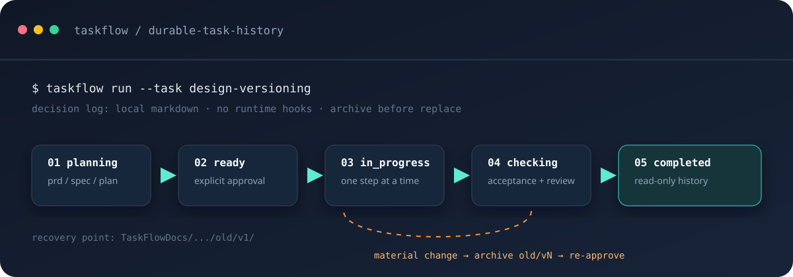
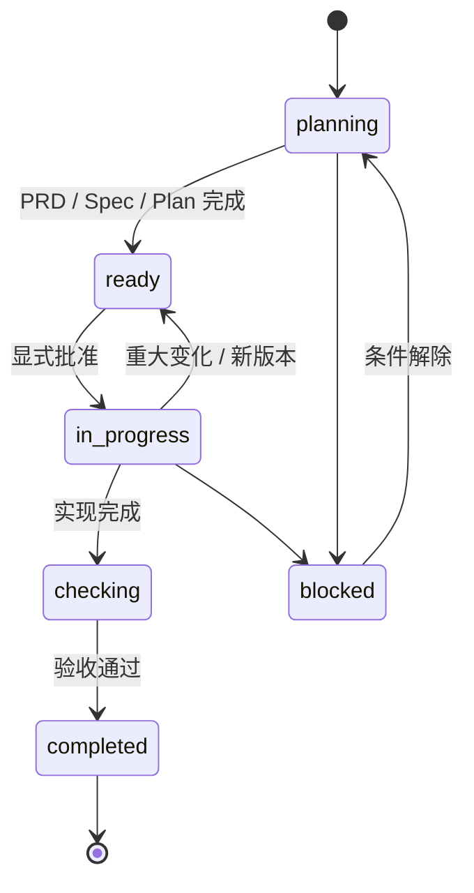

<div align="center">

# TaskFlow

### 为编码 Agent 保存可追溯的任务决策。

**本地 Markdown · 显式批准 · 可恢复设计历史**

[](skills/taskflow/SKILL.md)
[](skills/taskflow/references/artifacts.md)
[](LICENSE)

[English](README.md) · **中文说明**



</div>

> [!IMPORTANT]
> **TaskFlow 是流程约定，不是 Agent。** 它不选择工具、也不替 Agent 决策。它可与宿主/工具链 hook（Claude Code 与 Codex CLI）协作做有边界的记账和上下文摘要；hook 绝不写核心文档、绝不代为批准。它为人和 Agent 提供一个共同的、可检查的地方，记录任务是什么以及它如何变化。

## 它解决什么问题

Agent 可以很快交付代码，但代码背后的决策经常留不住：

| 没有持久任务记录 | 使用 TaskFlow |
| --- | --- |
| 需求、设计、计划散落在聊天和临时文件里 | 一个任务目录集中保存 PRD、Spec、Plan 和验证 |
| 新会话不知道哪些结论已确认 | 状态与批准记录明确可见 |
| 需求修改覆盖原设计，无法找回 | 重大变化先归档 `old/vN/`，再创建新版本 |
| 多人/多 Agent 按不同理解继续工作 | 共享同一份任务事实和版本边界 |
| 代码完成了，但取舍和验证过程消失 | 任务目录可随 Git 审查、交接和恢复 |

## 核心模型

```text
TaskFlowDocs/YYYY-MM-DD-short-slug/
├── prd.md          # 做什么 / 为什么 / 范围 / 验收
├── spec.md         # 怎么做 / 契约 / 取舍       （大型任务才需要）
├── plan.md         # 批准 / 步骤 / 验证 / 回滚
├── sessions.md     # 交接与恢复上下文           （可选）
├── reference/      # 调研与证据                 （可选）
└── old/vN/         # 被替代的逻辑版本             （可选）
```

这些文件刻意保持朴素：人能阅读，Agent 能加载，Git 能 diff，项目无需额外服务即可保存历史。

## 仓库文档

`TaskFlowDocs/repository-docs/index.md` 是仓库规则、仓库指引和有范围个人补充规则的权威路由与检查记录；具体规则内容仍以惯用位置上的源文档为准。

规划或实施非简单任务前，TaskFlow 仅在目录缺失、过期或任务需要未编目的文档类型时刷新目录，然后读取任务阶段适用的文档。目录只记录仓库相对路径，不把仓库自有文档复制或软链接到 `repository-docs/`；该目录只包含 `index.md` 和可选的 `personal/` 个人补充规则。经明确授权创建缺失文档时，TaskFlow 优先沿用已有惯用文件名，否则对应使用 `README.md`、`CONTRIBUTING.md`、`CODE_STYLE.md` 或 `ROADMAP.md`。发现遗留副本或链接时只报告，未经明确授权不迁移、不删除。

仓库文档优先于个人补充规则。对于非简单开发，如果缺少 `CONTRIBUTING.md` 或 `CODE_STYLE.md`，TaskFlow 会根据仓库证据起草最小可执行版本；无法从证据判断的政策每次最多按依赖顺序询问三个问题并给出建议，且必须经用户明确批准后才成为约束。`ROADMAP.md` 只有在用户确认产品方向后才起草；其他治理文档仅在当前任务需要时创建。`repository-docs/personal/` 下的个人补充只能增加更严格或正交的个人习惯，不能替代、弱化或冲突于仓库文档。适用文档契约的实质变化遵循与其他任务契约相同的版本门禁。

涉及 fork、远端或 Pull Request 时，TaskFlow 会记录已配置的 remote、目标仓库、base 分支、本地分支关系、远端跟踪信息的新鲜度限制、适用的托管平台规则和提交 PR 前检查。remote 名称不能证明其角色；TaskFlow 不会静默添加或改写 remote、fetch、rebase、merge、push、创建 PR 或声称已同步。

创建或更新 Pull Request 前，TaskFlow 必须读取适用的 `.github/pull_request_template.md`，完成每个必填项，在 `plan.md` 中记录字段映射和验证结果；必填项缺失或有歧义时禁止修改 PR。

可以运行 `bash hooks/repository-check [repo-root]` 获取可选的只读检查摘要。它会把缺失的基础治理文档和不明确的分支/远端信息标记为 `needs-user-input`，不会挂到自动 hook 上。

用户对已批准任务提出修正或新增要求时，TaskFlow 必须先分类再修改文档：只改措辞或实现路径的澄清属于工作修订，仅更新受影响记录并在 Plan 变更日志记一行；改动已批准的目标、需求、验收、范围或契约才创建新 Task version 并回到批准门禁。不得带着过期 Plan 继续实施。

## Todo 收件箱

TaskFlow 只自动用于仓库开发需求：功能、Bug 修复、重构、测试、配置/构建/CI 变更和发布准备。只读解释、翻译、状态查询、研究、审查和诊断不会创建 Todo 或任务文档；若之后要求实施，再从该实施请求开始进入流程。用户显式调用 `$taskflow` 时，规划或研究也会进入流程。对于适用请求，`TaskFlowDocs/todo.md` 是强制首条记录；条目按 `inbox → clarified → promoted → in_progress → done/cancelled` 演进，提升后创建 `prd.md`、按需创建 `spec.md` 和 `plan.md`，批准后才进入实施。

验证通过后，TaskFlow 将整个任务目录移入 `TaskFlowDocs/achieved/<task-id>/`，同步 Todo 的任务路径和 `done` 状态，并确认活动路径已不存在。已归档任务只读；其 `old/vN/` 历史仅在当前文档或版本摘要需要时才读取。之后若新工作属于该已完成交付物，先将目录取回活动根目录，记录 Todo 来源与重新打开原因，创建新的 Task version，并在修改实现前重新经过批准门禁。

<details>
<summary><strong>为什么不能只依赖 Git？</strong></summary>
<br />

Git 擅长记录机械修改；TaskFlow 增加的是**语义历史**：只有目标、范围、验收、架构、接口/数据契约、兼容性或风险决策发生变化，才创建新的 Task version（措辞与实现路径澄清为工作修订，不走版本通道）。这样保存的是“上一版设计意味着什么”，而不只是“哪些行变了”。

</details>

## 无侵入 Agent

| TaskFlow 提供 | TaskFlow 不会做 |
| --- | --- |
| 澄清 → 批准 → 实施 → 验证 → 归档的共同协议 | 当 Agent 或任务管理器本身；代理、守护进程或 API 网关 |
| 项目内 Markdown 任务事实 | 把状态藏在托管数据库或专有 UI |
| 状态、批准、交接、回滚和恢复记录 | 替换编辑器、Git、测试工具或其他 Skills |
| 重大决策的语义版本边界 | 强制 Agent 模型、编程语言、框架或工具链 |

在任一阶段开始实质工作前，Agent 都会检查宿主当前可用的 Skill、工具、MCP Server 和 Agent，并自由判断是否有能力能提供实质帮助。TaskFlow 不强制选择任何特定能力，也不限定名称、提供方、调用链、能力类别或数量。Agent 一旦选择使用某项能力，就先通过宿主机制真实调用或加载，再采用其工作流或输出；发现或选择本身不算调用。所有输出都先审阅再纳入，`plan.md` 只记录真实调用尝试及其结果。

TaskFlow 还可与宿主/工具链 hook（Claude Code 与 Codex CLI）协作：会话启动时，hook 只确定性维护 `repository-docs/index.md` 的路由元数据，并注入当前阶段适用的源文档路径和状态。Agent 先读 index，再读取其中导流的权威源文档，并把采用的路径和结论记录进 Plan。hook 不复制规则正文，不修改源规则、核心任务文档或审批，也不改变 Git 或托管平台状态。

## 防止设计丢失的一条规则

```text
普通修改：保持当前 vN

重大决策变化：归档 vN → 创建 vN+1 → 回到 ready → 重新批准
```

```diff
  TaskFlowDocs/2026-09-05-billing-export/
  ├── prd.md                       # 当前 v2
  ├── spec.md                      # 当前 v2 设计
  ├── plan.md                      # v2 批准与验证
+ └── old/v1/
+     ├── version.md               # v1 为什么被替代
+     └── snapshot/                # v1 恢复点
```

需求中途变化时，TaskFlow 不会覆盖唯一的设计文件，而是保留 v1、记录 v2 的变化原因，并要求重新批准后继续实施。

## 生命周期



| 状态 | 含义 |
| --- | --- |
| `planning` | 澄清需求、证据和设计 |
| `ready` | 文档完成，等待批准 |
| `in_progress` | 按批准后的计划实施 |
| `checking` | 运行验收与质量检查 |
| `completed` | 验证通过，作为只读历史归档 |
| `blocked` | 记录具体阻塞和所需输入 |

> [!WARNING]
> `ready` 不等于批准。批准必须写入 `plan.md`，然后才能进入 `in_progress`。

## 快速开始

TaskFlow 以插件形式分发（Claude Code / Codex 同一套市场）：`hooks/`、技能与安装配置都在一个仓库里，无需手动复制文件或手改 `settings.json`。

### 用 Claude Code 安装

先添加 TaskFlow 市场，再安装插件：

```bash
claude plugin marketplace add hkwuks/TaskFlow
claude plugin install taskflow@taskflow
```

> [!TIP]
> 会话内同样两步：`/plugin marketplace add hkwuks/TaskFlow` 然后 `/plugin install taskflow@taskflow`。

验证是否加载成功：

```bash
claude plugin list
#   taskflow@taskflow    Version: 1.0.3    Status: ✔ enabled
```

更新已有安装：

```bash
claude plugin marketplace update taskflow
claude plugin update taskflow@taskflow
claude plugin list
```

### 用 Codex CLI 安装

添加同一个市场，再安装插件：

```bash
codex plugin marketplace add hkwuks/TaskFlow
codex plugin add taskflow@taskflow
```

验证是否加载成功：

```bash
codex plugin list
#   taskflow@taskflow    installed, enabled
```

更新已有安装：

```bash
codex plugin marketplace upgrade
codex plugin add taskflow@taskflow
codex plugin list
```

### 想用本地副本？

如果不想信任远程仓库，可以把市场指向本地检出目录而不是 GitHub——插件和 hooks 就会运行在你自己的文件里：

```bash
# Claude Code
claude plugin marketplace add <仓库根目录>
claude plugin install taskflow@taskflow

# Codex CLI
codex plugin marketplace add <仓库根目录>
codex plugin add taskflow@taskflow
```

安装后告诉你的 Agent：

```text
使用 $taskflow 规划、执行、验证并归档这个任务。
```

然后把想法记录到 `TaskFlowDocs/todo.md`；澄清后的条目再提升为 `prd.md`、按需的 `spec.md` 和 `plan.md`；审阅任务文档并记录批准，再按每个步骤的 checklist 实施和记录验证结果。

> [!TIP]
> 边界清晰的简单单文件修改可以直接完成并做最小验证，不必为了流程创建空文档。

> [!NOTE]
> Hooks 是可选的。插件安装的 SessionStart hook 只打印一份简短的状态摘要（未完成的收件箱条目 + 活跃任务），让 Agent 不必重读整棵树；它不写任何文件，也从不批准。没有 hooks 的宿主按同样的流程运行。

对于机械性的生命周期更新，Agent 可以显式运行 `hooks/run-hook.cmd task intake|promote|state|progress|complete`；这些写命令不会绑定到事件 Hook。

## 与相邻工具的比较

TaskFlow 不试图替代 SDD、角色化多 Agent 方法或项目管理工具，它覆盖的是一个更具体的层：**仓库内持久化的任务事实、状态边界和可恢复决策历史。**

| | TaskFlow | [Spec Kit](https://github.com/github/spec-kit) | [OpenSpec](https://github.com/Fission-AI/OpenSpec) | [BMAD-METHOD](https://github.com/bmad-code-org/BMAD-METHOD) | Issue / 项目管理工具 |
| --- | --- | --- | --- | --- | --- |
| **主要关注** | 任务状态与语义历史 | 规范驱动开发流程 | 可配置的规范/变更流程 | 角色化 Agent 方法论 | 负责人和任务协调 |
| **核心单元** | 本地 TaskFlowDocs 目录 | Spec 与工作流产物 | Spec 与 change 产物 | Agent、角色与工作流 | Ticket、Card、Issue |
| **设计恢复** | 明确的 `old/vN/` 归档 | 取决于仓库和采用的流程 | 取决于项目配置与 Git 实践 | 取决于所选流程和仓库历史 | 通常只有活动记录 |
| **Agent 交互** | Skill 指令 + 有边界的宿主 hook 协作（Claude Code、Codex） | 工具/工作流约定 | 可配置工作流约定 | 角色与编排模式 | 通常在 Agent 上下文之外 |
| **基础设施** | Markdown + 文件系统 + Git | 仓库文件与配套工具 | 仓库文件与配套工具 | 方法论资产与配套工具 | 通常是托管服务 |
| **如何组合** | — | 用于生成规范，再将审阅后的事实放入任务目录 | 将审阅后的 Spec/change 放入任务目录 | 将角色产出作为参考/任务产物保存 | 将 Ticket 链接到任务目录 |

### 如何选择

- **上下文丢失、设计被覆盖、跨会话交接困难** → TaskFlow；
- **需要完整或可配置的 SDD 流程** → Spec Kit / OpenSpec；
- **需要角色化的多 Agent 交付方法** → BMAD-METHOD；
- **需要负责人、排期、优先级和报表** → Issue Tracker；
- **都需要** → 外部工具负责协调，TaskFlow 负责保存决策历史。

> [!NOTE]
> 这是定位比较，不是基准测试或功能数量排名。采纳前请核对各项目当前文档与兼容性。

## 设计原则

- **一个任务，一个事实来源。**
- **版本化决策，而不是每一次敲键。**
- **先归档，再替换。**
- **批准必须显式记录。**
- **用保持清晰所需的最轻量文档。**
- **工具可选，状态可检查。**
- **验证和恢复属于任务记录。**

## 仓库结构

```text
skills/taskflow/
├── SKILL.md                         # 工作流入口
├── agents/openai.yaml               # Agent 元数据与默认提示词
└── references/
    ├── artifacts.md                 # 文档模板与输出路由
    └── versioning-and-recovery.md   # 版本切换与安全恢复规则
```

## 许可证

[AGPL-3.0](LICENSE)
